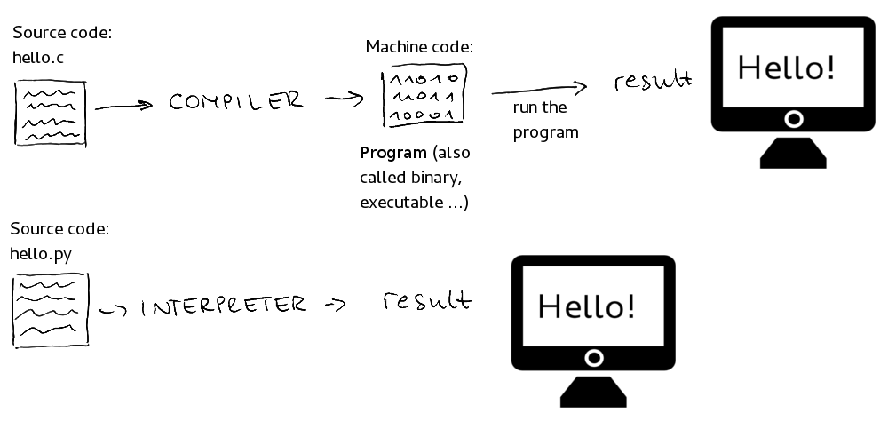
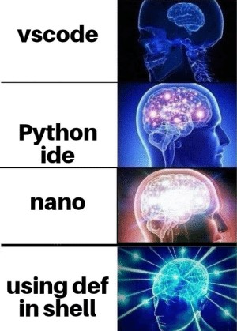
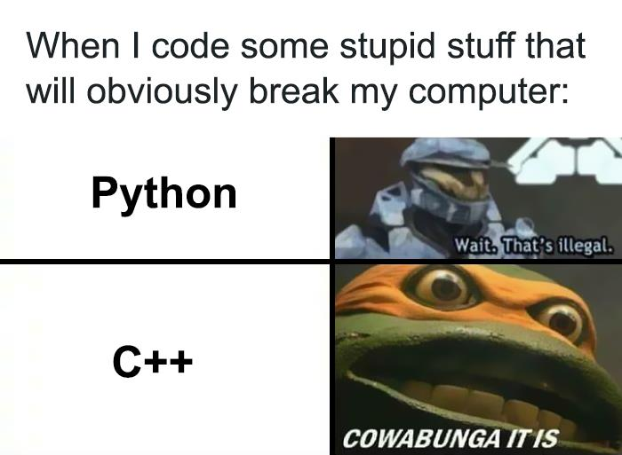
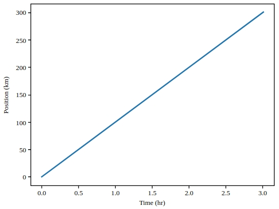
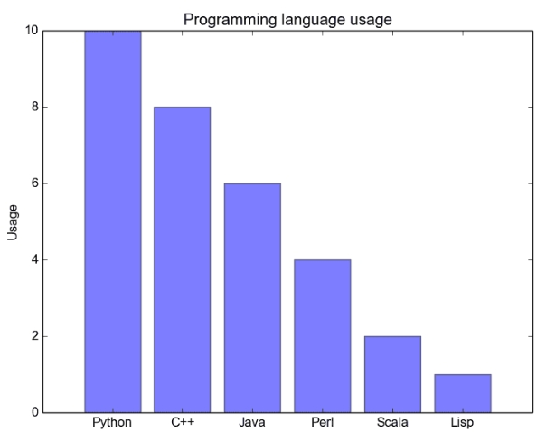

class: center, middle, inverse, small-images

# Introdução a Programação em Python


---
class: inverse

# Temas

1. Programação - O que é?
2. Programar em Python
3. Hello World - O Primeiro Programa
4. Variáveis
5. Operações Aritméticas
6. Estruturas Oondicionais (if)
7. Estruturas de Repetição (for, while)
8. Operações com Listas
9. Operações com Strings
10. Interação com o Utilizador
11. Funções
12. Tuplos
13. Dicionários
14. Debugging
15. Bibliotecas e Reutilização de Código

---
class: image-spaced

# Programação - O que é?
**Linguagens de Alto Nível** - Linguagens de Programação, como Java, C++ ou Python, que precisam de ser traduzidas para algo que o computador consiga executar.


**Linguagens Compiladas** - Linguagem que, após compilada, gera machine code (código-máquina) - C++, C, C#...

**Linguagens Interpretadas** - Linguagens em que o código, ao invés de ser compilado, é lido e executado por um programa - Python, JavaScript, BASIC...



---
class: small-images, image-spaced

# Programar em Python
- **Replit**: https://replit.com/
- GDB: https://www.onlinegdb.com/
- Python 3.10 (Shell): https://www.python.org/downloads/release/python-3100/
- **VS Code**: https://code.visualstudio.com/
- **Pycharm**: https://www.jetbrains.com/pycharm/
- **Spyder/Anaconda**: https://www.anaconda.com/

---
class: center, middle


---
# Programar em Python
## The Zen of Python
- Beautiful is better than ugly
- Explicit is better than implicit
- Simple is better than complex
- Complex is better than complicated
- Readability counts
- ...(it goes on but you get the point)

---
class: center, middle


---

# Hello World!
O programa "Hello World" é o típico primeiro programa que todos os iniciantes fazem numa qualquer nova linguagem de programação; em Python, este programa destaca-se pela sua simplicidade (o mesmo programa em C++ abaixo, **apenas** para efeitos de comparação):

```python
# O teu primeiro programa em Python! :)

print("Hello World!")
```
```cpp
// Não tentem isto em casa
#include <iostream>

using namespace std;

int main()
{
    cout<<"Hello World";

    return 0;
}
```

---
class: center, middle, inverse
# Variáveis


---
class: image-spaced

# Variáveis
## O que é uma variável?

Uma variável funciona como se fosse um "contentor", onde podemos armazenar dados.


---

# Variáveis
## Tipos de variáveis nativos

Em Python, há essencialmente 6 tipos principais de variáveis (tipos de dados) nativos da linguagem (isto é, sem ser necessário utilizar extensões adicionais):
- Números (ints e floats)
- Booleanos (Verdadeiro ou Falso)
- Strings (cadeias de caratéres)
- Listas 
- Tuplos <--
- Dicionários <--

(Estes dois últimos tipos de dados são mais complexos e serão abordados no final do workshop.)

**NOTA**: Ao contrário de outras linguagens (como C++), é perfeitamente possível alterar uma variável int para uma variável do tipo string em Python, pois não é necessário atribuir nenhum tipo específico às variáveis.

---
# Variáveis
## Números
Números podem ser de naturezas distintas:
- Números Inteiros - ints (e.g. 42)
- Números Reais - floats (e.g. 2.81)
- Números Reais representados em notação científica (e.g. 5.972e24, ou seja, 5.972 elevado a 24)
- ...

```python

x = 3
y = 2.5
pi = 3.141592
mach_10 = 3.43e3

print (x + y)

# Output: 5.5
```

## Booleanos

Valores booleanos seguem a Álgebra de Boole, podendo tomar apenas dois valores:
- True (Verdadeiro)
- False (Falso)

```python
best_halo_is_reach = True
python_sucks = False
print (best_halo_is_reach)

# Output: True
```

---
# Variáveis
## Strings

Strings representam cadeias de caracteres genéricas (letras, palavras, frases); as strings são **sempre** delimitadas por aspas.
- "X"
- "2016"
- "If only I could be so grossly incandescent!"

```python
senate = "Did you ever hear the tragedy of Darth Plagueis The Wise?"
also_senate = "I thought not. It’s not a story the Jedi would tell you."

print (senate + " " + also_senate)

# Output: Did you ever hear the tragedy of Darth Plagueis The Wise? I thought not. It’s not a story the Jedi would tell you.
```

## Listas

As listas representam "contentores" com capacidade de armazenar vários dados; são utilizadas para armazenar conjuntos de dados de qualquer tipo (mesmo de tipos diferentes) numa única "coleção" de tamanho variável (no sentido em que podemos alterar o seu tamanho, se assim o desejarmos!).

```python
lista_1 = [1, 3.0, 45, -2, 89, 1456732]

lista_2 = ["a", "67", 23, "Elden Ring"]

print(lista_1)

print(lista_2)
```

---

class: center, middle, inverse
# Operações Aritméticas

---
# Operações Aritméticas
Em Python, existem 7 tipos de operações aritméticas básicas, que nos permitem realizar cálculos numéricos:

- Soma, **+**
- Subtração, **-**
- Multiplicação, __*__
- Divisão, **/**
- Expoente, __**__
- Divisão Inteira (Integer Division/Floor Division), **//**
- Resto da Divisão Inteira (Modulus), **%**

**NOTA**: Ao contrário de linguagens como C++, Python possui um símbolo específico que diferencia a divisão "normal" de divisão inteira!

---
# Operações Aritméticas
```python
x = 8
y = 3

print("x + y = ", x+y)   # Soma

print("x - y = ", x-y)  # Subtração

print("x * y = ", x*y)   # Multiplicação

print("x / y = ", x/y)   # Divisão

print("x ** y = ", x**y)  # Expoente

print("x // y = ", x//y)  # Divisão Inteira (Integer/Floor Division)

print("x % y = ", x%y)   # Resto da Divisão Inteira (Modulus)
```

---
# Operações Aritméticas

Apesar de ser principalmente utilizados para operações numéricas, alguns destes operadores podem também ser utilizados com outros tipos de variáveis (strings) ou até com coleções (listas) - ainda que a sua funcionalidade seja ligeiramente diferente!

**Strings**:

```python
senate = "Did you ever hear the tragedy of Darth Plagueis The Wise?"
also_senate = "I thought not. It’s not a story the Jedi would tell you."

tragedy = senate + also_senate

print (tragedy)
```

**Listas**:
```python
score_1P = [45, 58, 23, 97, 10]
score_2P = [55, 60, 58, 82, 14]

all_scores = score_1P + score_2P

print(all_scores)
```

---
class: center, middle, inverse
# Estruturas Condicionais (**if**)

---
# Estruturas Condicionais
## Operadores Lógicos

- **&gt**; ("maior que")
- **<** ("menor que")
- **==** ("igual a")
- **!=** ("diferente de")
- **&gt;=** ("maior ou igual que")
- **<=** ("menor ou igual que")
- **and** (logic AND - "e", operador booleano)
- **or** (logic OR - "ou", operador booleano)
- **not** (logic NOT - "não", operador booleano)

Estes operadores permitem-nos obter valores lógicos por si só (True ou False).

```python
attempt = 8765

key = 8764

value = (attempt == key)

print(value)
```

---
# Estruturas Condicionais

No entanto, a principal utilidade dos operadores lógicos está em permitir a criação de estruturas condicionais, que permitem executar certas secções de código **apenas se certas condições se verificarem**, através do uso de **if statements**.

Estas estruturas seguem o seguinte modelo (pseudo-código):
```
if (<condição>):
    <instrução1>
    <instrução2>
    <instrução3>
    ...
elif (<condição>):
    <instrução4>
    <instrução5>
    <instrução6>
else:
    <instrução7>
    <instrução8>
    <instrução9>
    ...
```
- **if**: Se a condição for verdadeira, executa o código ("body" do if).
- **elif**: Significa "else if"; se a condição do *if* for falsa, testar a condição de *elif* e executar o código se esta for verdadeira.
- **else**: Se nenhuma das condições anteriores se verifica (é verdadeira), executar este código.

**IMPORTANTE**: Ao contrário de outras linguagens, a indentação (indentation) é muito importante em Python; falhas de indentação levam a erros no programa/código nesta linguagem.

---
# Estruturas Condicionais
## Exemplo 1.1: Verificação de Idade
```python
idade = 16

if (idade < 18):
    print("Menor de Idade")
else:
    print("Maior de Idade")
```

## Exemplo 1.2: Verificação de Idade (ERRO - verificar indentação!)
```python
idade = 16

if (idade < 18):
print("Menor de Idade")
else:
print("Maior de Idade")
```

---
# Estruturas Condicionais
## Exemplo 2: Batalha Simples
```python
player_level = 48
boss_level = 50
great_weapon = True


if (player_level > boss_level and great_weapon):
    print("Vitória!")
elif (player_level > boss_level and (not great_weapon)):
    print("Sobreviveste...por um triz")
else:
    print("Derrota")
```

---
# Estruturas Condicionais
## Exemplo 3: Depois da Queima.py
```python
drunk = False
license = False
ticket = None    # Se quisermos criar uma variável sem nenhum valor atribuído, podemos atribuir-lhe o valor None

if (drunk and not license):
    ticket = 300
elif (drunk and license):
    ticket = 200
elif (not drunk and not license):
    ticket = 100
else:
    ticket = 0

print("Multa:", ticket)
```

---
class: center, middle, inverse
# Estruturas de Repetição (for, while)

---
# Estruturas de Repetição

Estruturas de repetição permitem-nos executar certas secções de código múltiplas vezes (sem ter que reescrever o código várias vezes), através da criação de loops com um alcance definido (**for loops**) ou indefinido (**while loops**)

---
# Estruturas de Repetição
## O ciclo While (while loop)
Os ciclos While permitem executar um conjunto de instruções um número indefinido de vezes - enquanto uma condição específica se verificar, o código presente no body do loop vai correr.

Os while loops são representados da seguinte forma (pseudo-código):
```python
while (<condição>):
    <instrução1>
    <instrução2>
    <instrução3>
```

**Exemplo: Contador**
```python
num = 0

while (num < 10):
    num = num + 1
    print(num)
final = num
print(final)
```
No entanto, não é estritamente necessário ter uma condição explícita para criar um while loop; podemos criar loops somente com condições booleanas (no entanto, é preciso utilizar statements específicos para terminar o loop; caso contrário, ele continuará a correr infinitamente, causando erros/crashes).

```python
num = 0
while true:
    num += 1
    ...
```

---
# Estruturas de Repetição
## O ciclo For (for loops)

Ao invés dos ciclos While, os ciclos For permitem executar um conjunto de instruções um número específico de vezes.

Os for loops são representados da seguinte forma (pseudo-código):
```python
for <variável> in <sequência>: # a sequência tanto pode ser uma range de números como uma coleção (uma lista, por exemplo)
    <instrução1>
    <instrução2>
    <instrução3>
```

---
# Estruturas de Repetição
**Exemplo 1:**
```python
# Imprimir no ecrã todos os números entre 0 e 9

for num in range(10):
    print(num)
```

**Exemplo 2:**
```python
# Imprimir no ecrã todos os números entre 2 e 10, de 2 em 2

for num in range(5, 11, 2):
    print(num)
```

**Exemplo 3:**
```python
# Imprimir no ecrã todos os nomes

slashers = ["Freddy", "Jason", "Michael", "Billy"]
for killer in slashers:
    print(killer)
```

**NOTA**: Existe outra forma de aceder aos elementos de uma lista através de um for loop, através do index operator (que vamos ver mais tarde).

---
# Estruturas de Repetição

- **continue**: Permite fazer o loop saltar para a próxima iteração do ciclo, ignorando todo o código presente a seguir ao statement na iteração atual

```python
for num in range(10):      # números ímpares
    if (num % 2 == 0):  
        continue           # se o número for par, saltamos para a próxima iteração e "ignoramos" o print()
    print(num)
```

- **break**: Permite sair do ciclo a meio da sua execução; especialmente útil para sair de loops que, caso contrário, seriam infinitos.

```python
# Imprimir todos os números até encontrar um múltiplo de 7
for numero in range(1,50):
    if (numero % 7 == 0):
        break
    print(numero)
```
```python
num = 12          
while True:             # Imprimir os restos da divisão de todos os números entre 12 e 19 por 10
    remain = 0
    if num == 20:
        break
    remain = num % 10 
    num += 1
    print(remain)
```

---
class: center, middle, inverse
# Operações com Listas

---
# Operações com Listas
- **Index Operator []**: Permite o acesso a qualquer elemento de uma lista.

**NOTA 1**: A primeira posição de qualquer lista é 0, ou seja, lista[0] representa o primeiro elemento de uma lista; por essa razão, o index máximo de uma lista será sempre o número de elementos menos 1.

**NOTA 2**: Python permite o acesso a elementos de uma lista através de indexes negativos - lista[-1] representa o último elemento de uma lista, lista[-2] o penúltimo...

```python
worlds = ["Coruscant", "Corellia", "Nar Shadaa", "Tatooine", "Raxus Prime", "Dathomir"]

worlds[5] = "Naboo"

print(worlds[0])  # Obter primeiro elemento da lista
print(worlds[2])  # Obter terceiro elemento da lista
print(worlds[-1]) # Obter último elemento da lista
```

**.remove() Method**: Remove a primeira ocorrência do elemento passado como argumento numa lista.
**del Keyword**: Permite eliminar um elemento de uma lista com base no seu index.
**.pop() Method**: Permite eliminar um elemento de uma lista com base no seu index, retornando o valor.

```python
worlds = ["Coruscant", "Corellia", "Nar Shadaa", "Tatooine", "Raxus Prime", "Dathomir"]
del worlds[2]
worlds.remove("Corellia")
capital = worlds.pop(0)

print(capital)
print(worlds)
```

**.append() Method**: Permite adicionar um elemento ao final de uma lista
**.insert() Method**: Permite inserir um elemento num index específico de uma lista

```python
consoles = ["VCS", "Genesis", "GameCube"]
consoles.append("PS4")
consoles.insert(3, "360")
print(consoles)
```

---
# Operações com Listas

**Slice Operator [m:n]**: Permite acesso a um segmento específico da lista, que começa em lista[m] e acaba em lista[n-1].

```python
consoles = ["VCS", "Genesis", "GameCube", "360", "PS4"]
print(consoles[1:4])   # Obtém sublista com elementos de index 1, 2 e 3 da lista
print(consoles[2:])    # Obtém todos os elementos com index igual ou superior a 2 
print(consoles[:1])    # Obtém todos elementos com index inferior a 1
```

**.reverse() Method**: Permite reverter a ordem de uma lista.

```python
fibonacci = [0, 1, 1, 2, 3, 5, 8]
fibonacci.reverse()
print(fibonacci)
```

Ordenar uma lista:
```python
lotaria = [41, 3, 1, 33, 42]
lotaria.sort()
print(lotaria)
```

---
# Operações com Listas

Tamanho de uma lista:
```python
carbonara = ["bacon", "azeite", "massa", "ovos", "pimenta preta", "queijo"]
numero_ingredientes = len(carbonara)
print(numero_ingredientes)
```

Obter o mínimo e o máximo de uma lista:
```python
lotaria = [41, 3, 1, 33, 42]
minimo = min(lotaria)
maximo = max(lotaria)
print(minimo)
print(maximo)
```

---
# Operações com Listas
**Exemplo:** Soma de todos os elementos de uma lista
```python
lista_numeros = [1, 2, 3, 4]
soma = 0

for numero in lista_numeros:
    soma = soma + numero
    
print(soma)
```

---
class: center, middle, inverse
# Operações com Strings

---
# Operações com Strings

Aceder ao elemento de uma string:
```python
nome = "Pedro"
print(nome[3])  # Obter terceira letra da String
print(nome[-1]) # Obter última letra da String
```

Tamanho de uma string:
```python
autor = "Chbosky"
tamanho = len(autor)
print(tamanho)
```

Formatar uma string:
```python
frase = "hEllO wOrLD"
print(frase.upper())  # TUDO EM MAIÚSCULAS!
print(frase.lower())  # tudo em minúsculas.
```

---
# Operações com Strings

Obter parte de uma string:
```python
frase = "Onde está o Wallie?"
nome = frase[12:18]
verbo = frase[5:9]

print(nome)
print(verbo)
```

Encontrar uma string dentro de outra string
```python
frase = "Onde está o Wallie?"
indice_nome = frase.find("Wallie")      # Índice 12
indice_vegetal = frase.find("batata")   # Não existe!!

print(indice_nome)
print(indice_vegetal)
```

---
# Operações com Strings

Substituir parte de uma string:
```python
frase_presente = "Onde está o Wallie?"
frase_passado = frase_presente.replace("está", "esteve") # Presente -> Passado
print(frase_passado)
```

Contar o número de ocorrências de uma string dentro de outra string:
```python
frase = "A ana comeu o pudim da mariana"
numero_ocorrencias = frase.count("ana")
numero_ocorrencias2 = frase.count("ana", 10)    # Ocorrências a partir do índice 10

print(numero_ocorrencias)
print(numero_ocorrencias2)
```

---
class: center, middle, inverse
# Funções

---
# Funções
Funções são a forma de reutilizarmos código! 

Elas funcionam tal e qual como uma função matemática.

Um exemplo - Função matemática f(x,y) = 4x + 2y²
```python
# Definição da função
def funcao(x, y):
    return 4*x + 2*y*y

# Utilização da função
valor1 = funcao(2, 1)
valor2 = funcao(5, 0)
print(valor1)
print(valor2)
```


---
# Funções
Funções são também a forma de reutilizarmos código! 

A seguinte secção de código calcula a soma de 4 listas diferentes:
```python
lista1 = [1, 2, 3, 4]
lista2 = [2, 2, 2, 2, 2, 2]
lista3 = [0, 0, 1, 0, 1]

soma = 0
for numero in lista1:
    soma = soma + numero
print(soma)

soma = 0
for numero in lista2:
    soma = soma + numero
print(soma)

soma = 0
for numero in lista3:
    soma = soma + numero
print(soma)
```

**Problema**: Código repetido três vezes - uma vez para cada lista 

---
# Funções
**Solução**: Definir uma função para somar uma lista!
```python
def soma_lista(lista):  # A função recebe um ARGUMENTO: a lista a somar
    soma = 0
    for numero in lista:
        soma = soma + numero
    return soma         # O valor que a função que retorna

lista1 = [1, 2, 3, 4]
lista2 = [2, 2, 2, 2, 2, 2]
lista3 = [0, 0, 1, 0, 1]

soma1 = soma_lista(lista1)
soma2 = soma_lista(lista2)
soma3 = soma_lista(lista3)

print(soma1)
print(soma2)
print(soma3)
```

---
class: center, middle, inverse
# Interação com o Utilizador

---
# Interação com o Utilizador

**Exemplo 1:** Perguntas simples ao utilizador

```python
nome = input("Insira o seu nome: ")
idade = input("Insira a sua idade: ")

print("Nome: " + nome)
print("Idade: " + idade)
```

---
# Interação com o Utilizador

**Exemplo 2:** Tirar a carta!

```python
idade = input("Insira a sua idade: ")
idade = int(idade)  # Converter para inteiro!!!

if (idade < 16):
    print("Não pode tirar a carta :(")
if (idade >= 16):
    print("Pode tirar a carta de motociclos")
if (idade >= 18):
    print("Pode tirar a carta de ligeiros")
if (idade >= 21):
    print("Pode tirar a carta de pesados")
```

---
# Interação com o Utilizador

**Exemplo 3:** Construir uma lista de 3 números pares:

```python
lista = []

while (len(lista) < 3):
    resposta = input("Insira um número: ")
    numero = int(resposta)
    
    if (numero % 2 == 0):
        lista.append(numero)
    else:
        print("Número introduzido não é par! Tente novamente.")
        
print("Lista introduzida: ")
print(lista)
```

---
class: center, middle, inverse
# Tuplos

---
# Tuplos
Tuplos são muito semelhantes a listas, embora sejam uma estrutura de dados **imutável**, isto é, assim que são criados **não podem ser alterados**.

```python
linguagens = ("c++", "python", "java", "php", "golang") # Parentesis curvos!
numero_linguagens = len(linguagens)

print("Este é um workshop de " + linguagens[1])
print(numero_linguagens)

print("Um sub-tupulo:")
print(linguagens[1:3])
```

Como os tuplos são **imutáveis**, as seguintes instruções iriam originar um erro!
```python
linguagens = ("c++", "python", "java", "php", "golang")
del linguagens[1]               # Impossível remover!
linguagens[3] = "javascript"    # Impossível alterar!
```


---
class: center, middle, inverse
# Dicionários

---
# Dicionários
Dicionários são idênticos a listas, mas em vez de serem indexados por números naturais consecutivos, podem ser indexados por qualquer tipo de variável!

Funcionam, de certa forma, como uma tabela:

```python
matriculas = {"Paulo": "44-XX-77", "Mariana": "14-MH-19"}
print(matriculas["Paulo"])
print(matriculas["Mariana"])
print(matriculas["Ze"])     # Origina um erro porque esta 
                            # entrada não existe no dicionário!
```

Cada entrada de um dicionário designa-se por um par "**Chave: Valor**". No exemplo acima, as **chaves** seriam os nomes e os **valores** seriam os números de telefone / telemóvel.

---
# Dicionários
Muitas funções anteriormente estudadas aplicam-se também a dicionários!

```python
paginas_amarelas = {"Paulo": 224127304, "Ana": 913845822, "Pedro": 933744912}

# Obter número de entradas nas páginas amarelas
print(len(paginas_amarelas))

# Remover um contacto
del paginas_amarelas["Pedro"]

# Alterar um contacto
paginas_amarelas["Ana"] = 123456789

print(paginas_amarelas)
```

---
# Dicionários
Outras funções são exclusivas aos dicionários:

```python
paginas_amarelas = {"Paulo": 224127304, "Ana": 913845822, "Pedro": 933744912}

# Criar uma "lista" com todos os nomes (chaves)
nomes = paginas_amarelas.keys()

# Criar uma "lista" com todos os números (valores)
numeros = paginas_amarelas.values()

# Verificar se elemento se encontra no dicionário
if ("Paulo" in paginas_amarelas):
    print("Contacto do Paulo encontrado!")
    print(paginas_amarelas["Paulo"])
else:
    print("Não foi encontrado o número do Paulo")
```

---
class: center, middle, inverse
# Bibliotecas e Reutilização de Código

---
# Bibliotecas e Reutilização de Código
Há muitos developers de python espalhados por todo o mundo, todos a desenvolver milhares de funções diariamente.

A melhor forma de desenvolver código rapidamente e colaborativamente com outras pessoas é **reutilizando** código desenvolvido por outros.

Esse código encontra-se dentro de **Bibliotecas**, que são um ficheiro (ou conjuntos de ficheiros) com diversas funções (e outras coisas!).

Python é famoso pelo seu "*lado científico*" fácil de programar.

Para importar uma biblioteca, utiliza-se a instrução **import**:

```python
import <nome_da_biblioteca>
```

---
# Bibliotecas e Reutilização de Código
**Exemplo 1:** Programa para fazer um gráfico que traça a variação da posição em função do tempo:

```python
import matplotlib.pyplot as plt

time = [0, 1, 2, 3]
position = [0, 100, 200, 300]
plt.plot(time, position)
plt.xlabel('Time (hr)')
plt.ylabel('Position (km)')
```

---
class: medium-images
# Bibliotecas e Reutilização de Código
**Exemplo 1:** Resultado


---
# Bibliotecas e Reutilização de Código
**Exemplo 2:** Programa para fazer um gráfico da utilização das linguages de programação:
```python
import matplotlib.pyplot as plt; plt.rcdefaults()
import numpy as np
import matplotlib.pyplot as plt
 
objects = ('Python', 'C++', 'Java', 'Perl', 'Scala', 'Lisp')
y_pos = np.arange(len(objects))
performance = [10,8,6,4,2,1]
 
plt.bar(y_pos, performance, align='center', alpha=0.5)
plt.xticks(y_pos, objects)
plt.ylabel('Usage')
plt.title('Programming language usage')
 
plt.show()
```

---
class: medium-images
# Bibliotecas e Reutilização de Código
**Exemplo 2:** Resultado


---
class: center, middle, inverse
# Bónus: Exercícios

---
# Bónus: Exercícios
## Exercício 1
Desenvolve um programa que, dado um número inserido pelo utilizador, o caraterize como ímpar ou par.

---
# Bónus: Exercícios
## Exercício 1 - Solução
```python
resposta = input("Insira um número: ")
numero = int(resposta)

if (numero % 2 == 0):   
    print("O número é par.")
else:                   
    print("O número é ímpar.")
```

---
# Bónus: Exercícios
## Exercício 2
Desenvolve um programa que pede ao utilizador que insira 5 números e que calcule a sua média.

---
# Bónus: Exercícios
## Exercício 2 - Solução
```python
# Função para obter números introduzidos pelo utilizador
def obterNumeros():
    numeros = []
    for i in range(5):
        resposta = input("Insira um número: ")
        numeros.append(int(resposta))
    return numeros

# Função para obter a média de uma lista de números
def obterMedia(numeros):
    soma = 0
    for numero in numeros:
        soma = soma + numero
    return (soma/len(numeros))
    

numeros = obterNumeros()
media = obterMedia(numeros)
print(media)
```

---
class: center, middle, inverse
# Fim!
